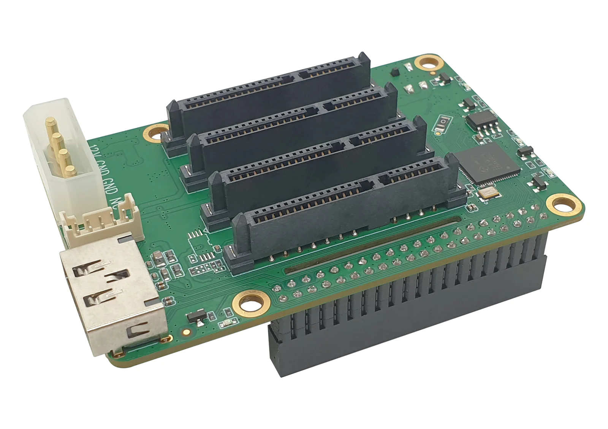
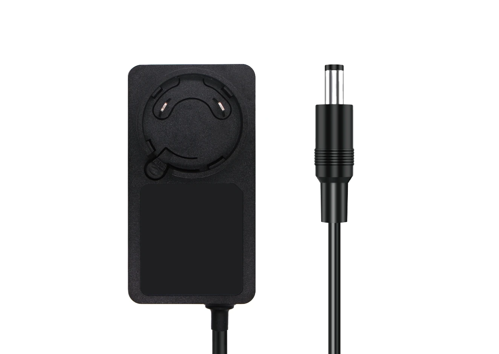

# Raspberry Pi NAS Builder

Radxa Penta SATA HAT을 장착한 Raspberry Pi 5로 NAS를 구축하는 C 자동화 도구.
공식 문서 기준 30여 개의 명령이 필요한 초기 설정을 두 개의 실행 파일로 줄인다.



2026년 1월부터 개인 스토리지로 운영 중이다.

---

## 왜 만들었나

Radxa 공식 문서에는 필요한 명령이 모두 있다. 문제는 그것을 한 번만 치는 게
아니라는 점이었다. RAID 레벨을 바꾸거나 설정을 손볼 때마다 디스크 초기화부터
Samba 설정까지 전 과정을 다시 밟아야 했고, 중간에 한 단계를 빠뜨리면 어디서
틀어졌는지 찾는 데 더 오래 걸렸다.

셸 스크립트 대신 C를 택한 이유는 두 가지다. 각 단계의 실패를 종료 코드로 받아
다음 단계로 넘어가지 않게 막고 싶었고, RAID 레벨별 바이너리를 컴파일 시점에
분리하고 싶었다.

```bash
# 기존: 문서를 보며 30여 개 명령을 순서대로
sudo apt install mdadm samba -y
sudo mdadm --create /dev/md0 --level=5 ...
sudo mkfs.ext4 /dev/md0
sudo vim /etc/samba/smb.conf
# ...

# 이 도구
sudo ./setup_app
sudo ./raid5
```

---

## 설계

### RAID 레벨을 컴파일 타임에 분기한다

RAID 레벨은 한 번 정하면 바뀌지 않는 값이라 실행할 때마다 판단할 이유가 없다.
`-DRAID_LEVEL` 매크로로 단일 소스에서 네 개의 바이너리를 만든다.

```make
raid0:  $(CC) $(CFLAGS) -DRAID_LEVEL=0  -o raid0  $(RAID_SRC) $(LIB_SRC)
raid1:  $(CC) $(CFLAGS) -DRAID_LEVEL=1  -o raid1  $(RAID_SRC) $(LIB_SRC)
raid5:  $(CC) $(CFLAGS) -DRAID_LEVEL=5  -o raid5  $(RAID_SRC) $(LIB_SRC)
raid10: $(CC) $(CFLAGS) -DRAID_LEVEL=10 -o raid10 $(RAID_SRC) $(LIB_SRC)
```

각 바이너리는 자기 레벨의 코드만 갖는다. 실행 파일 이름이 곧 무엇을 만드는지를
말하므로, 잘못된 인자로 의도하지 않은 RAID를 구성할 여지가 없다.

### 실패한 명령에서 멈춘다

`mdadm --create`가 실패했는데 `mkfs.ext4`가 이어서 도는 것이 가장 위험하다.
모든 상태 변경 명령을 `check_exit`로 감싸 종료 코드가 0이 아니면 그 자리에서
중단한다.

```c
void check_exit(int status, const char *message)
{
  if (status != 0) {
    fprintf(stderr, "\n[오류] %s (코드: %d)\n", message, status);
    exit(EXIT_FAILURE);
  }
}
```

### 설정 파일에 중복으로 쓰지 않는다

`setup_app`은 재실행될 수 있다. `/boot/firmware/config.txt`에 PCIe 설정을
추가하기 전에 이미 같은 줄이 있는지 확인한다.

```c
if (!grep_config(CONFIG_FILE, "dtparam=pciex1_gen=3")) {
    fprintf(file, "dtparam=pciex1_gen=3\n");
}
```

---

## 빠른 시작

### 필요한 것

```
Raspberry Pi 5 (4GB 이상)
Radxa Penta SATA HAT
SATA SSD/HDD 2.5" x 4
12V 5A 전원 어댑터 (5525 잭)   ← 필수. 아래 "전원" 절 참고
Raspberry Pi OS Lite (64-bit)
```

### 실행

```bash
git clone https://github.com/epqlffltm/pi-nas-builder.git
cd pi-nas-builder
make

sudo ./setup_app     # 최초 1회. 완료 후 재부팅된다
sudo ./raid5         # raid0 / raid1 / raid5 / raid10 중 선택
```

Windows에서는 `\\<라즈베리파이_IP>\NAS_Storage_RAID5`로 접속한다.

> **RAID 구성 시 연결된 모든 디스크의 데이터가 삭제된다.**
> 백업 없이 실행하지 말 것.

---

## 구조

```
pi-nas-builder/
├── Makefile              # RAID 레벨별 빌드 타겟
├── setup/
│   └── setup.c           # 패키지 설치, PCIe Gen3, 방화벽, 로케일
├── install/
│   └── raid_main.c       # 디스크 초기화 → RAID 생성 → 포맷 → 마운트
└── lib/
    ├── nas_lib.c         # RAID 생성, Samba·fstab 설정, 공통 유틸
    └── nas_lib.h
```

`setup_app`은 시스템을 준비하고 재부팅까지, `raid*`는 디스크를 구성하고
공유를 여는 것까지 담당한다. 둘을 나눈 이유는 PCIe Gen3 활성화가 재부팅을
요구하기 때문이다.

---

## RAID 레벨

Penta SATA HAT이 디스크 4개까지 지원하므로 아래 범위에서 고른다.

| RAID | 최소 디스크 | 가용 용량 | 특징 |
|------|-----------|----------|------|
| 0 | 2 | 100% | 이중화 없음. 디스크 하나가 죽으면 전부 잃는다 |
| 1 | 2 | 50% | 이중화 우선 |
| 5 | 3 | 75% | 용량과 이중화의 절충. 일반적인 NAS 용도 |
| 10 | 4 | 50% | 성능과 이중화 |

---

## 겪은 문제

### 전원 부족으로 인한 I/O 에러

```
I/O error, dev sda, sector 1234
md/raid5:md0: read error
```

Raspberry Pi의 USB 전원만으로는 SSD 4개를 구동할 수 없다. 디스크가 간헐적으로
인식되지 않거나 RAID 동기화 중에 에러가 나면 대부분 이 문제다.



Penta SATA HAT 전용 12V 5A 어댑터가 필요하다. 인터페이스는 5525(외경 5.5mm,
내경 2.5mm), 극성은 중앙 양극이다.

### 디스크가 사용 중이라며 잡히지 않음

```
mdadm: Cannot open /dev/sda: Device or resource busy
```

이전 RAID의 메타데이터가 남아 있는 경우다. RAID를 만들기 전에 기존 배열을 멈추고
superblock과 파일시스템 지문, 파티션 테이블을 차례로 지운다.

```c
system("mdadm --stop /dev/md* 2>/dev/null");
sprintf(cmd, "mdadm --zero-superblock %s 2>/dev/null", disks[i]);
sprintf(cmd, "wipefs -a %s && sgdisk --zap-all %s", disks[i], disks[i]);
```

### Samba 접속 거부

방화벽이 Samba 포트를 막고 있는 경우다. `setup_app`이 NetBIOS(137·138/udp)와
SMB(139·445/tcp)를 열고 SSH는 유지한다.

---

## 미디어 스트리밍은 제외했다

구축 후 Jellyfin을 올려 스트리밍 서버로 쓰려 했으나 재생이 끊겼다. 원인은
Raspberry Pi 5의 SoC에 하드웨어 비디오 인코더가 없어 트랜스코딩이 전량 CPU
소프트웨어 처리로 떨어지는 것이었다. 코드로 해결할 수 있는 문제가 아니라
하드웨어의 한계였다.

4K 실시간 변환이 불가능하다고 판단해 스트리밍은 범위에서 빼고 파일 서버 용도로
확정했다. 기능을 하나 덜어낸 대신 남은 용도로는 안정적으로 동작하며, 그래서
지금까지 계속 쓰고 있다.

---

## FAQ

<details>
<summary><b>RAID 6은 지원하나요?</b></summary>

Penta SATA HAT이 디스크 4개까지만 지원한다. RAID 6은 패리티를 2개 쓰므로 4개로는
가용 용량이 RAID 10과 같아지면서 성능만 손해다.
</details>

<details>
<summary><b>ZFS를 쓸 수 있나요?</b></summary>

Raspberry Pi 5의 메모리로는 권장 사양에 미치지 못한다. 초기에 메모리 크기를
검사하는 코드를 넣었다가 ZFS를 쓰지 않기로 하면서 제거했다.
</details>

<details>
<summary><b>Raspberry Pi 4에서 되나요?</b></summary>

Penta SATA HAT이 PCIe 인터페이스를 요구하므로 Pi 5 전용이다.
</details>

<details>
<summary><b>디스크를 2~3개만 쓰고 싶습니다</b></summary>

`install/raid_main.c`의 디스크 배열과 `cleanup_disks`·`create_raid`에 넘기는
개수를 함께 수정해야 한다.

```c
const char *disks[] = {"/dev/sda", "/dev/sdb"};
cleanup_disks(disks, 2);
create_raid(RAID_LEVEL, disks, 2);
```
</details>

---

## 개발 환경

- C (ISO C99), GCC
- Raspberry Pi 5 (8GB) + Radxa Penta SATA HAT + SATA SSD 1TB x 4
- VSCode 원격 SSH (Windows), vim

## 참고

- [Radxa Penta SATA HAT 문서](https://docs.radxa.com/en/accessories/storage/penta-sata-hat)
- [Linux mdadm](https://raid.wiki.kernel.org/index.php/RAID_setup)